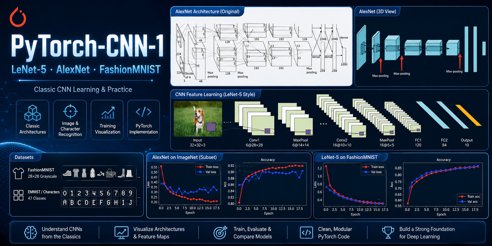
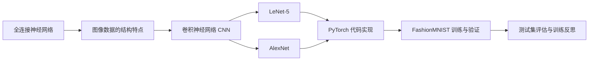
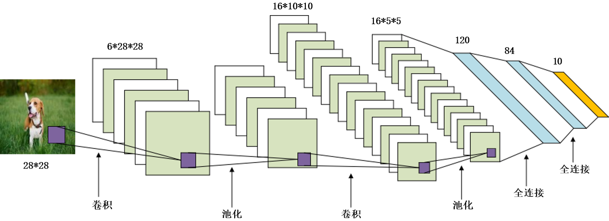
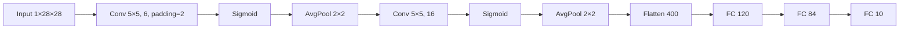
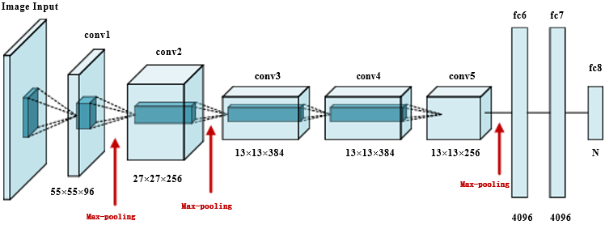
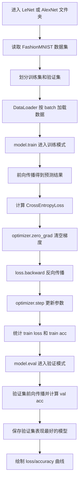
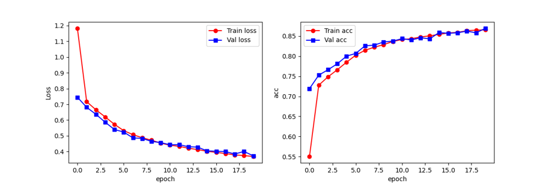
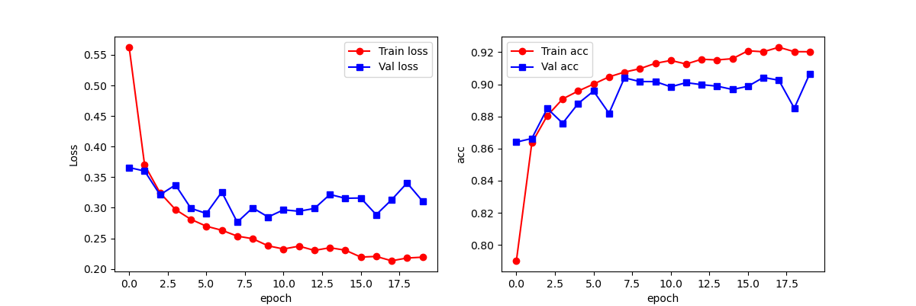

# PyTorch 经典卷积神经网络学习与实战：LeNet-5 & AlexNet



> **从全连接网络到卷积神经网络，从论文阅读到代码训练。**  
> 本项目围绕 CNN 的核心思想、LeNet-5 的经典结构、AlexNet 的关键创新，以及基于 FashionMNIST 的模型训练流程展开。它不仅是一份代码实践，更是一段把公式、论文、PPT、代码、训练日志逐渐串起来的学习记录。

---

## 🌟 项目概览

本仓库记录了我对经典卷积神经网络的系统学习过程，主要内容包括：

- 阅读并理解经典论文：
  - **LeNet-5**：Yann LeCun 等人的 *Gradient-Based Learning Applied to Document Recognition*
  - **AlexNet**：Krizhevsky、Sutskever、Hinton 的 *ImageNet Classification with Deep Convolutional Neural Networks*
- 学习整理成PPT：从全连接网络出发，逐步讲解 CNN、LeNet-5、AlexNet。
- 使用 **PyTorch** 搭建经典 CNN 模型。
- 基于 **FashionMNIST** 数据集完成训练、验证与测试流程。
- 记录训练模型过程中对数据、网络结构、损失函数、优化器、验证集和泛化能力的理解。

这个项目的重点是通过一次完整的训练实践，真正理解模型是怎样一步步从数据中学习特征、修正参数、提升泛化能力~

---

## 📥 学习资料整理

| 资料 | 下载/查看链接 | 说明 |
|---|---|---|
| AlexNet 原论文 | [Download AlexNet Paper](<./assets/papers/【AlexNet】 imagenet-classification-with-deep-convolutional-neural-networks.pdf>) | ImageNet 经典论文，重点看 ReLU、Dropout、GPU 训练和大规模数据 |
| LeNet-5 原论文 | [Download LeNet-5 Paper](<./assets/papers/【LeNet】 Gradient-Based Learning Applied.pdf>) | CNN 早期经典论文，重点看局部连接、权重共享和 LeNet-5 结构 |
| 学习 PPT | [Download Study PPT](<./assets/ppt/Pytorch框架与经典卷积神经网络与实战(一).pdf>) | 我整理的 CNN、LeNet、AlexNet 学习材料 |
| LeNet 模型代码 | [LeNet/model.py](./LeNet/model.py) | LeNet-5 网络结构定义 |
| LeNet 训练代码 | [LeNet/model_train.py](./LeNet/model_train.py) | LeNet-5 在 FashionMNIST 上的训练与验证流程 |
| LeNet 测试代码 | [LeNet/model_test.py](./LeNet/model_test.py) | 加载 LeNet 最优模型并在测试集上评估 |
| AlexNet 模型代码 | [AlexNet/model.py](./AlexNet/model.py) | AlexNet 网络结构定义 |
| AlexNet 训练代码 | [AlexNet/model_train.py](./AlexNet/model_train.py) | AlexNet 在 FashionMNIST 上的训练与验证流程 |
| AlexNet 测试代码 | [AlexNet/model_test.py](./AlexNet/model_test.py) | 加载 AlexNet 最优模型并在测试集上评估 |

> 说明：论文放在 `assets/papers/`，PPT 放在 `assets/ppt/`，图片放在 `assets/images/`，代码分别放在 `LeNet/` 和 `AlexNet/` 目录下。


---

## 🧠 学习主线

我把整个学习过程拆成了以下线索：



---

## 📚 学习经历与阅读收获

### 1. 从全连接网络到 CNN：为什么要换思路?

在 PPT 里，我先复习了全连接网络：输入层、隐藏层、输出层、前向传播、损失函数、反向传播和梯度下降。  
刚开始看这些内容时，我觉得神经网络好像就是一堆矩阵乘法；但真正结合图像任务后，我发现全连接网络有一个很明显的问题：

> 它会把图片拉平成一长串数字，原本上下左右相邻的像素关系就被打散了。

比如一张衣服图片，本来袖子、领口、边缘这些结构是有空间位置关系的。  
如果直接拉平成一维向量，模型虽然也能学，但会更吃力，参数量也会变大。

CNN 的思路就自然很多：  
它不会一上来就把图片全部拍扁，而是先用卷积核在局部区域里找边缘、纹理、形状，再一层层组合成更高级的特征。

---

### 2. CNN 核心原理：我对它们的理解

| 概念 | 我的理解 |
|---|---|
| 卷积核 | 像一个局部特征探测器，在图片上滑动，负责在图像不同位置寻找相似模式 |
| 权重共享 | 同一个卷积核在整张图像上滑动，减少参数量，也增强平移适应能力 |
| 填充 Padding | 给图片边缘补一圈，避免边缘信息太快丢失 |
| 步幅 Stride | 控制卷积核移动速度，影响下采样程度。步幅越大，输出特征图越小 |
| 多通道卷积 | RGB 或多特征图输入时，卷积核需要覆盖所有输入通道 |
| 池化层 | 降低空间分辨率，保留主要特征，减少计算量，常见的是最大池化和平均池化 |
| 感受野 | 网络越深，后面神经元能看到的原图区域越大 |

我逐渐认识到很多，如：  

**卷积层不是简单地压缩图片，而是在保留空间结构的前提下提取局部特征；**

**池化层也不是随便降维，而是在牺牲部分精确位置的同时换取更强的鲁棒性。**

---

### 3. LeNet-5：CNN 的经典起点

<p align="center">
  
</p>

LeNet-5 是早期卷积神经网络的代表模型，用于手写数字识别。它的思想非常清晰：



本项目中 LeNet 的实现思路为：

- 输入：`1 × 28 × 28` 灰度图；
- 第一层卷积：`Conv2d(1, 6, kernel_size=5, padding=2)`；
- 第一层池化：`AvgPool2d(kernel_size=2, stride=2)`；
- 第二层卷积：`Conv2d(6, 16, kernel_size=5)`；
- 第二层池化：`AvgPool2d(kernel_size=2, stride=2)`；
- 展平后得到 `16 × 5 × 5 = 400` 个特征；
- 最后通过 `120 -> 84 -> 10` 的全连接层完成分类。

**搭建模型的过程中，我意识到每一层的网络参数要搞清楚，不然后面训练一定要出问题。**

而搞清楚参数值需要熟记重要公式：

$$
O_W = \left\lfloor \frac{W + 2P - F_W}{S} \right\rfloor + 1
$$

$$
O_H = \left\lfloor \frac{H + 2P - F_H}{S} \right\rfloor + 1
$$

**在卷积神经网络中，输入图像经过卷积层后，输出特征图的高和宽可以通过此公式计算。**

---

### 4. AlexNet：深度 CNN 的突破

<p align="center">
  
</p>


AlexNet 相比 LeNet 更深、更大，也更接近现代深度学习模型。论文中给我印象最深的几点是：

- 使用 **ReLU** 替代 sigmoid/tanh，大幅加快训练速度；
- 使用 **Dropout** 减少全连接层过拟合；
- 使用 **最大池化** 替代平均池化，增强主要特征响应；
- 使用**数据增强**提升模型鲁棒性；
- 依靠 **GPU 训练**大规模网络，使深度 CNN 在 ImageNet 上取得突破。

我在项目里也实现了一个适配 FashionMNIST 的 AlexNet 版本：

- 原始 AlexNet 输入是 RGB 图像，我这里改成了灰度图输入；
- 原始 AlexNet 输出 1000 类，我这里改成了 FashionMNIST 的 10 类；
- 保留了 ReLU、MaxPool、Dropout 和大规模全连接层这些核心思想。

AlexNet 给我的最大启发是：  
**模型能力、数据规模、训练技巧、硬件算力是共同推动深度学习发展的四个关键因素。**

---

## 🗂️ 项目文件结构

目前仓库按照 **LeNet、AlexNet、assets 资源文件** 三部分来组织：两个模型的代码互不干扰，论文、PPT、图片也统一放在 `assets/` 里，README 引用起来更方便。

```text
PyTorch-CNN-1/
├── README.md
├── AlexNet/
│   ├── __pycache__/
│   ├── AlexNet_train_val_loss_acc.png
│   ├── model.py
│   ├── model_test.py
│   └── model_train.py
├── LeNet/
│   ├── __pycache__/
│   ├── LeNet_train_val_loss_acc.png
│   ├── model.py
│   ├── model_test.py
│   ├── model_train.py
│   └── plot.py
└── assets/
    ├── images/
    │   ├── alexnet_structure.png
    │   ├── alexnet_train_result.png
    │   ├── front-cover.png
    │   ├── lenet_structure.png
    │   └── lenet_train_result.png
    ├── papers/
    │   ├── 【AlexNet】 imagenet-classification-with-deep-convolutional-neural-networks.pdf
    │   └── 【LeNet】 Gradient-Based Learning Applied.pdf
    └── ppt/
        └── Pytorch框架与经典卷积神经网络与实战(一).pdf
```


---

## ⚙️ 环境配置

建议使用 Python 3.8 及以上版本。项目主要基于 PyTorch 和 torchvision，其他库用于画图和查看模型结构。

```bash
pip install torch torchvision pandas matplotlib torchsummary
```

项目主要依赖：

| 库 | 用途 |
|---|---|
| `torch` | 搭建模型、定义损失函数、优化器和训练流程 |
| `torchvision` | 下载和处理 FashionMNIST 数据集 |
| `pandas` | 整理训练过程中的 loss 与 accuracy |
| `matplotlib` | 绘制训练/验证曲线 |
| `torchsummary` | 查看模型结构和参数规模 |

如果电脑支持 CUDA，代码会自动优先使用 GPU；如果没有 GPU，也可以直接在 CPU 上运行，只是训练速度会慢一些~


---

## 🚀 运行方式

因为 LeNet 和 AlexNet 分别放在不同文件夹中，所以运行时建议先进入对应目录，再执行训练或测试脚本。

### 1. 训练 LeNet-5

```bash
cd LeNet
python model_train.py
```

训练完成后，会保存验证集表现最好的模型参数，并生成 LeNet 的训练/验证曲线。

### 2. 测试 LeNet-5

```bash
cd LeNet
python model_test.py
```

测试脚本会加载训练阶段保存的最优模型参数，并在 FashionMNIST 测试集上计算准确率。

### 3. 训练 AlexNet

```bash
cd AlexNet
python model_train.py
```

AlexNet 的结构更深、参数更多，训练时间一般会比 LeNet 更长，但也能更直观地体会深层 CNN 的表达能力。

### 4. 测试 AlexNet

```bash
cd AlexNet
python model_test.py
```

测试阶段只进行前向传播，不会更新模型参数，因此代码中会使用 `model.eval()` 和 `torch.no_grad()`。


---

### 2. 测试模型

```bash
python model_test.py
```

测试脚本完成的工作包括：

1. 加载 FashionMNIST 测试集；
2. 加载训练阶段保存的最优模型参数；
3. 设置模型为 `eval()` 模式；
4. 使用 `torch.no_grad()` 关闭梯度计算；
5. 统计测试集预测正确数量和最终准确率。

---

## 🏋️ 训练流程详解

训练代码的整体思路并不复杂，但每一步都很关键。我的理解是：模型训练不是一次性得到结果，而是不断重复“预测、计算误差、反向传播、更新参数”的过程。



本项目训练配置：

| 项目 | 设置 |
|---|---|
| 数据集 | FashionMNIST |
| 训练集规模 | 约 48000 张 |
| 验证集规模 | 约 12000 张 |
| 测试集规模 | 10000 张 |
| Batch Size | 128 |
| Epoch | 20 |
| 优化器 | Adam |
| 学习率 | 0.001 |
| 损失函数 | CrossEntropyLoss |
| 设备选择 | CUDA 可用则使用 GPU，否则使用 CPU |

按照当前训练设置，模型在训练阶段大约会经历：

- 每个 epoch 约 `48000 / 128 = 375` 个训练 batch；
- 20 个 epoch 约 `375 × 20 = 7500` 次参数更新；
- 每个 epoch 约 94 个验证 batch；
- 20 个 epoch 约 1880 次验证 batch 评估；
- 测试阶段对 10000 张测试图片进行最终评估。

这让我直观感受到：  
**训练模型不是简单点击运行，而是成千上万次“预测—计算损失—反向传播—参数更新”的循环。**


---

## 📊 训练曲线与结果分析

<p align="center">
  
  
</p>


从训练曲线里能看到两个阶段：

### LeNet-5 的训练感受

LeNet 的 loss 整体稳定下降，accuracy 也逐步上升，说明它确实在学习。  
不过它的上限相对有限，毕竟结构比较轻量，对 FashionMNIST 这种比手写数字更复杂的数据集来说，表达能力会受到一些限制。

### AlexNet 的训练感受

AlexNet 的训练集准确率更高，测试集表现也更好，但从曲线看，验证集 loss 后期会有波动。  
这让我第一次比较直观地感受到：  
**模型更强不一定永远更省心，参数越多，越要小心过拟合。**

| 模型    |       数据集 | Epoch | Test Acc | 我的理解                                 |
| ------- | -----------: | ----: | -------: | ---------------------------------------- |
| LeNet-5 | FashionMNIST |    20 |   85.87% | 结构清楚、适合入门，但表达能力有限       |
| AlexNet | FashionMNIST |    20 |   89.93% | 能力更强，但更需要关注过拟合和训练稳定性 |

---

## 💡 训练模型的感悟与收获


### 1. 训练模型不是运行代码，而是理解数据如何流动

真正当我写训练代码时，我发现每一步都很关键：

- 图片如何从 PIL 图像变成 Tensor；
- Tensor 的形状为什么是 `[batch_size, channel, height, width]`；
- batch_size 为什么会影响显存和训练速度；
- 输出为什么是 `[batch_size, num_classes]`；
- 标签为什么是一维类别编号；
- loss 为什么可以反向传播到每一层参数。

当这些维度和流程真正理清后，模型就不再是一个黑盒，而是一条清楚的数据管道。

---

### 2. Loss 下降的背后，是参数在一点点被修正

训练过程中最有成就感的时刻，是看到 loss 慢慢下降、accuracy 慢慢上升。  
但这背后不是模型突然“变聪明”了，而是每一次 batch 都在做同样的事情：

1. 前向传播得到预测；
2. 用交叉熵损失衡量预测错误程度；
3. 反向传播计算每个参数对错误的影响；
4. Adam 优化器根据梯度更新参数；
5. 下一次预测比上一次更接近真实标签。

这让我真正理解了“学习”的含义：  
**模型不是被直接告诉答案，而是在大量错误中逐渐修正自己。**

---

### 3. 验证集让我意识到：训练好不等于泛化好

如果只看训练集准确率，很容易以为模型越来越好。  
但验证集提醒我：模型真正重要的能力，是面对没见过的数据时还能不能判断正确。

这也是为什么代码中保存的是 **验证集准确率最高** 的模型，而不是最后一个 epoch 的模型。

这个设计让我理解了机器学习中非常重要的一点：  
**训练集表现代表记忆能力，验证集表现更接近泛化能力。**

---

### 4. 过拟合不是抽象概念，而是训练中随时可能发生的问题

研究 AlexNet 时，我对 Dropout 印象很深。  
Dropout 并不是简单“删掉神经元”，而是在训练过程中强迫网络不要过度依赖某几个特定神经元，从而提升整体泛化能力。

这让我意识到：

- 模型参数越多，表达能力越强；
- 但表达能力越强，也越可能记住训练集细节；
- 因此正则化、数据增强、验证集监控都非常重要。

LeNet 的结构比较轻量，适合入门理解；AlexNet 参数更多、能力更强，也更需要训练技巧控制过拟合。

---

### 5. 模型结构中的每一个尺寸都必须认真计算

LeNet 中 `f5 = nn.Linear(400, 120)` 这一行让我印象很深。  
为什么是 400？

因为输入 `1×28×28` 经过：

- 第一层卷积后仍为 `6×28×28`；
- 平均池化后为 `6×14×14`；
- 第二层卷积后为 `16×10×10`；
- 第二次池化后为 `16×5×5`；
- 展平后就是 `16 × 5 × 5 = 400`。

这让我明白，深度学习代码不是随便堆层。  
**每一层的输入输出尺寸都必须能接上，否则模型根本无法训练。**

---

### 6. 训练模型也是一种工程能力

这次实践让我体会到，深度学习不仅是数学和论文，也是工程：

- 数据路径要正确；
- 模型类名要和导入语句对应；
- 训练和测试要使用同一份模型结构；
- 保存模型时最好使用相对路径；
- 测试时要切换 `eval()`；
- 评估时要关闭梯度计算；
- 指标记录要清晰，方便复盘。

这些小细节，是我在学习过程中自己真实的记录。任何一个出错，都会影响整个训练流程。

---

### 7. 从 LeNet 到 AlexNet，我看到了深度学习的发展逻辑

LeNet 让我理解 CNN 的基本结构：卷积、池化、全连接。  
AlexNet 让我看到深度 CNN 真正走向大规模应用需要更多条件：

- 更大的数据集；
- 更深的网络；
- 更快的激活函数；
- 更强的硬件；
- 更有效的防过拟合方法；
- 更系统的训练策略。

从这个角度看，AlexNet 的意义不只是更深，而是它把深度学习从经典 CNN 推向了大规模视觉识别时代。

---

## ✅ 项目学习成果

通过这个项目，我完成了以下学习成果：

- 理解全连接神经网络在图像任务中的局限；
- 掌握 CNN 的基本组成：卷积、激活、池化、全连接；
- 能够手动推导卷积层和池化层输出尺寸；
- 理解 LeNet-5 的结构设计与历史意义；
- 理解 AlexNet 的关键创新：ReLU、Dropout、最大池化、数据增强；
- 能够使用 PyTorch 定义 CNN 模型；
- 能够完成 FashionMNIST 的训练、验证、测试流程；
- 能够记录 loss 和 accuracy 并绘制训练曲线；
- 对模型训练中的过拟合、泛化、参数更新、验证集选择有了更具体的认识。

---

## 📌工作量总结

本项目不是只写了一个模型，而是完成了一套从理论到实践的学习闭环。

| 模块 | 工作内容 |
|---|---|
| 论文阅读 | 阅读 LeNet-5 与 AlexNet 相关经典论文，理解 CNN 发展脉络 |
| PPT 制作 | 制作约 45 页学习材料，覆盖全连接网络、CNN、LeNet、AlexNet |
| 理论整理 | 梳理卷积、池化、填充、步幅、多通道、感受野等基础概念 |
| 模型实现 | 使用 PyTorch 搭建 LeNet-5 与 AlexNet 思路的模型结构 |
| 训练代码 | 编写训练集/验证集划分、训练循环、最优模型保存和曲线绘制 |
| 测试代码 | 编写测试集加载、模型参数加载、准确率统计流程 |
| 代码注释 | 对关键训练步骤添加详细注释，方便复习和二次学习 |
| 训练复盘 | 总结 loss、accuracy、验证集、过拟合、模型泛化等训练感悟 |

从上传代码统计看，训练、模型和测试相关代码合计约 480 行。  
更重要的是，这些代码背后包含了完整的深度学习训练流程，而不是零散的函数调用。

---

## 🔧 后续改进方向

后续我希望继续完善这个项目：

- [x] 将 LeNet 与 AlexNet 分别整理到独立文件夹，优化项目结构；
- [ ] 增加随机种子，提升实验可复现性；
- [ ] 增加 `Normalize` 数据标准化；
- [ ] 保存训练日志为 CSV 文件；
- [ ] 增加混淆矩阵，分析模型容易混淆的类别；
- [ ] 加入单张图片预测可视化；
- [ ] 对比 LeNet 与 AlexNet 在 FashionMNIST 上的训练时间和准确率；
- [ ] 尝试数据增强，观察是否能提升验证集表现；
- [x] 使用 GPU 训练更深模型，进一步理解算力对深度学习的影响。

---

## 📝 最后的小结

这次项目让我真正意识到：

> **训练模型不是把代码跑通，而是在数据、结构、损失、优化和泛化之间不断建立理解。**

从 LeNet 到 AlexNet，我不只是学到了两个经典模型，更重要的是学会了怎么观察训练过程、怎么分析曲线、怎么判断模型有没有真的学到东西。  
这也是我觉得这次学习最有价值的地方。
